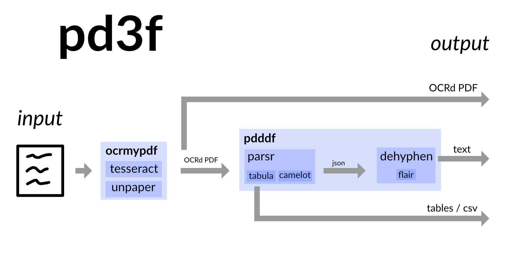
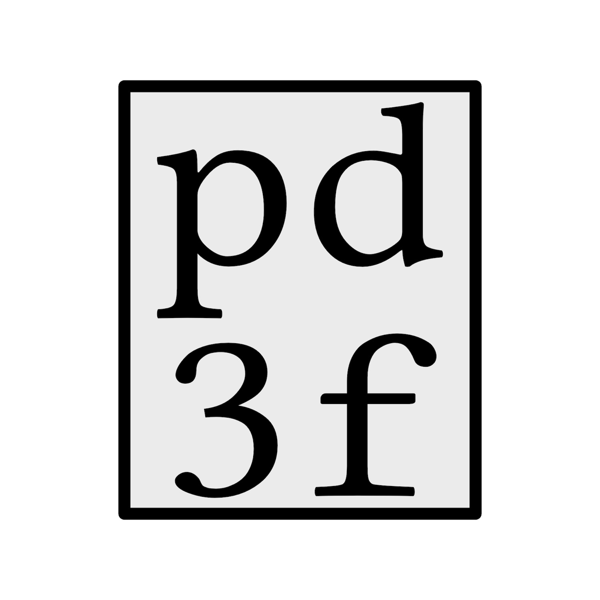

# `pd3f`

*Experimental, use with care.*

`pd3f` is a PDF **text extraction** pipeline that is self-hosted, local-first and Docker-based.
It **reconstructs** the original **continuous text** with the help of **machine learning**.

`pd3f` can OCR scanned PDFs with [OCRmyPDF](https://github.com/jbarlow83/OCRmyPDF) (Tesseract) and extracts tables with [Camelot](https://github.com/camelot-dev/camelot) and [Tabula](https://github.com/tabulapdf/tabula).
It's built upon the output of [Parsr](https://github.com/axa-group/Parsr).
Parsr detects hierarchies of text and splits the text into words, lines and paragraphs.

Even though Parsr brings some structure to the PDF, the text is still scrambled, i.e., due to hyphens.
The underlying Python package [`pd3f-core`](https://github.com/pd3f/pd3f-core) tries to reconstruct the original continuous text by removing hyphens, new lines and / or spaces.
It uses [language models](https://machinelearningmastery.com/statistical-language-modeling-and-neural-language-models/) to guess how the original text looked like.

`pd3f` is especially useful for languages with long words such as German.
It was mainly developed to parse German letters and official documents.
Besides German `pd3f` supports English, Spanish and French.
More languages will be added a later stage.

`pd3f` includes a Web-based GUI and a [Flask](https://flask.palletsprojects.com/)-based microservice (API).
You can find a demo at [demo.pd3f.com](https://demo.pd3f.com).

## Documentation

Check out the full Documentation at: <https://pd3f.com/docs/>

## Future Work / TODO

PDFs are hard to process and it's hard to extract information.
So the results of this tool may not satisfy you.
There will be more work to improve this software but altogether, it's unlikely that it will successfully extract all the information anytime soon.

Here some things that will get improved.

### statics about how long processing (per page) took in the past

- calculate runtime based on `job.started_at` and `job.ended_at`
- Get average runtime of jobs and store data in redis list

### more information about PDF

- NER
- entity linking
- extract keywords
- use [textacy](https://github.com/chartbeat-labs/textacy)

### add more language

- check if flair has model
- what to do if there is no fast model?


### Python client

- simple client based on request
- send whole folders

### Markdown / HTML export

- go beyond text

### use pdf-scripts / allow more processing

- reduce size
- repair PDF
- detect if scanned
- force to OCR again

### improve logs / get better feedback

- show uncertainty of ML model
- allow different log levels

## Related Work

- https://github.com/axa-group/Parsr
- https://github.com/jzillmann/pdf-to-markdown
- some PDF processing tools in [my blog post](https://johannesfilter.com/python-and-pdf-a-review-of-existing-tools/)

## Development

Install and use [poetry](https://python-poetry.org/).

Initially run:

```bash
./dev.sh --build
```

Omit `--build` if the Docker images do not need to get build.
Right now Docker + poetry is not able to cache the installs so building the image all the time is uncool.

## Contributing

If you have a **question**, found a **bug** or want to propose a new **feature**, have a look at the [issues page](https://github.com/pd3f/pd3f/issues).

**Pull requests** are especially welcomed when they fix bugs or improve the code quality.


## License

Affero General Public License 3.0


